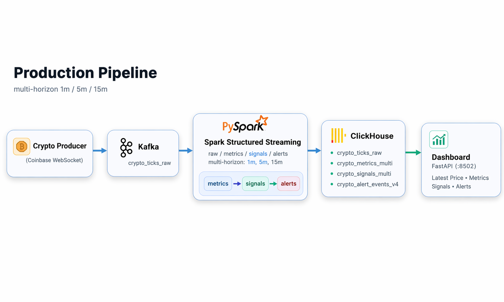

# 🚀 Real-Time Crypto Monitoring Pipeline

<p align="center">
  <!-- Badges -->
  
  
  
  
  
  
</p>

<p align="center">
  <b>Multi-horizon streaming analytics · signal-driven insights · actionable alerts</b><br>
  Kafka · Spark Structured Streaming · ClickHouse · FastAPI
</p>

---

<p align="center">
  
  <br>
  <em>End-to-end pipeline: Raw → Metrics → Signals → Alerts</em>
</p>

---

<p align="center">
  <b>Real-time data → feature engineering → signal interpretation → decision system</b>
</p>

---

## 🧩 TLDR;

A **real-time crypto market monitoring system** that transforms streaming data into **interpretable signals** and **actionable alerts** through a multi-layer architecture.

### Core Features

- ⚡ Real-time ingestion (Coinbase WebSocket → Kafka)
- 📊 Multi-horizon analytics (1m / 5m / 15m)
- 🧠 Signal interpretation layer (metrics → signals)
- 🚨 Confidence-based alert system
- 📡 FastAPI dashboard with ClickHouse backend

---

## 📐 Data Model

### Raw Layer
- `crypto_ticks_raw`

### Metrics Layer
- `crypto_metrics_multi`

### Signal Layer
- `crypto_signals_multi`

### Alert Layer
- `crypto_alert_events_v4`

---

## ⚡ Signal Engine

Separates:
- **Metrics** — what happened
- **Signals** — what it means
- **Alerts** — what to do

---

## 📊 API Endpoints

- `/api/signals`
- `/api/signals/latest`
- `/api/alerts`
- `/api/symbol/{symbol}/summary`
- `/api/symbol/{symbol}/signals`
- `/api/symbol/{symbol}/history`

---

## ▶️ Quick Start

```bash
./run.sh spark_streaming
```

Open:
```
http://localhost:8502
```

---

## 🛠️ Tech Stack

- Kafka
- Spark Structured Streaming
- ClickHouse
- FastAPI
- Docker

---

## 🎯 Why This Project

- Real-time system design
- Signal abstraction layer
- Decision-oriented data pipelines

---

## 🚧 Future Work

- ML-based signal scoring
- Anomaly detection
- Alert routing (Slack / Email)

---

## 📄 License

MIT
